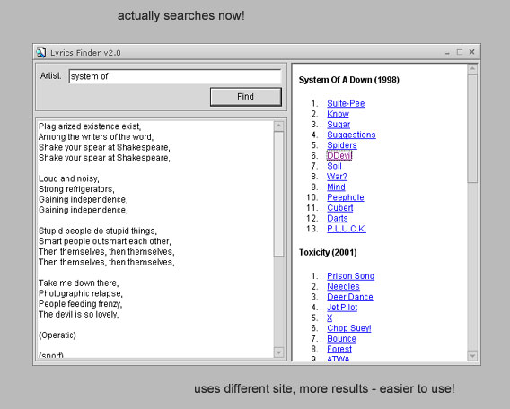

## Lyrics Search v2\.0 \- works alot better\!

### Description

Tired of slow lyrics finding websites with all their popups? I was, until one night I decided to start a little something that turned into a big something. A very useful utility, this can retrive lyrics by artist or or both artist and song name for a quick find. You will see nothing from any lyrics website, this parses the pages from letssingit.com and puts the lyrics into a rich textbox complete with html parsing (bold, italic, etc). If you like, vote - alot of work was put into this. Any improvements are welcome.

Code is now somewhat commented, better than before. This version was totally rewritten to the new website, which works A LOT better. For example, you can put in "system of" and "system of a down" lyrics would come up.

The known bugs are:

* random numbers in song list (winsock control did that somehow, doesnt really affect anything)

* when there are search RESULTS, the results dont show up. A very annoying little problem, I'll fix it soon. Otherwise put in the EXACT artist or something closer to it and you'll get good results.
 
### More Info
 

             |
---                |---
**Submitted On**   |2002-08-21 08:52:10
**By**             |[James Balducci](https://github.com/Planet-Source-Code/PSCIndex/blob/master/ByAuthor/james-balducci.md)
**Level**          |Intermediate
**User Rating**    |4.8 (19 globes from 4 users)
**Compatibility**  |VB 5\.0, VB 6\.0
**Category**       |[Sound/MP3](https://github.com/Planet-Source-Code/PSCIndex/blob/master/ByCategory/sound-mp3__1-45.md)
**World**          |[Visual Basic](https://github.com/Planet-Source-Code/PSCIndex/blob/master/ByWorld/visual-basic.md)
**Archive File**   |[Lyrics\_Sea1206328212002\.zip](https://github.com/Planet-Source-Code/james-balducci-lyrics-search-v2-0-works-alot-better__1-38141/archive/master.zip)

